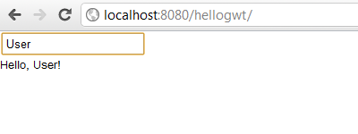

Разрабатываем приложение на Spring и GWT. Часть 3 - GWT RPC сервисы
-------------------------------------------------------------------
* `hellogwt-3 - Alex Tretyakov Blog`: [http://alextretyakov.blogspot.com/2011/10/spring-gwt-3-gwt-rpc.html](http://alextretyakov.blogspot.com/2011/10/spring-gwt-3-gwt-rpc.html)
* `hellogwt-3 - Revision 6: /trunk`: [http://hellogwt-3.googlecode.com/svn/trunk/](http://hellogwt-3.googlecode.com/svn/trunk/)
> В процессе написания приложения будут использоваться:
>
>- Spring 3.0.5
>- GWT 2.4.0
>- Maven 3.0.3
>- Tomcat 6.0.33 ([http://localhost:8080/hellogwt/](http://localhost:8080/hellogwt/))

> В этой части мы рассмотрим, как обеспечить обмен данными между клиентской и серверной частями нашего приложения с помощью [GWT RPC](http://code.google.com/webtoolkit/doc/latest/tutorial/RPC.html) сервиса.

